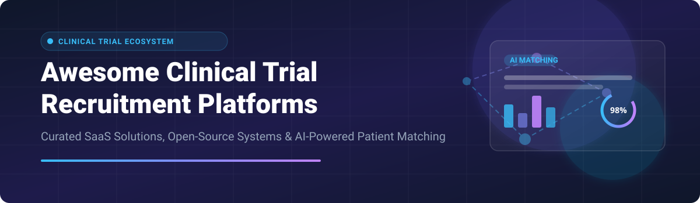

# 🏥 Awesome Clinical Trial Recruitment Platform 🚀

     

---

## 🌟 Top Clinical Trial Recruitment Platforms Ecosystem

> **Comprehensive Curated Directory of SaaS Products, Enterprise Solutions & Open-Source GitHub Projects**  
> *Specialized in Patient Matching, Automated Prescreening, EHR Data Mining, Site Feasibility & AI-Powered Trial Enrollment*  
> **📅 Last updated: September 2026**

This curated repository tracks premier **commercial SaaS platforms** and production-proven **open-source projects** for **Clinical Trial Recruitment** and patient enrollment optimization. These software applications empower sponsors, contract research organizations (CROs), research sites, and oncology centers to identify eligible patient cohorts, automate screening against protocol inclusion/exclusion criteria, and accelerate overall clinical trial velocity.

Whether you are looking for enterprise-grade SaaS tools (e.g., *TriNetX, Reify Health, Deep 6 AI, Antidote, TrialSpark*) or self-hosted open-source matching infrastructure (*recruIT, MatchMiner, CancerTrialMatch, TrialGPT, LLM-Match*), this guide covers market capabilities, pricing structures, valuation benchmarks, and source code links.

---

## 📑 Table of Contents
- [📊 SaaS / Hosted Platforms](#-saas--hosted-platforms)
- [🔓 Open-Source GitHub Projects](#-open-source-github-projects)
- [🤝 How to Contribute](#-how-to-contribute)
- [🛡️ Disclaimer](#️-disclaimer)
- [💖 Support](#-support)
- [📈 Star History](#-star-history)

---

## 📊 SaaS / Hosted Platforms

### 💡 Market Size & Industry Structure
> 📈 **Market Size & Fragmented Structure**: The global **Clinical Trial Recruitment & Patient Matching Market** is estimated at **$3.8 Billion to $4.2 Billion (2025/2026)** and is projected to reach over **$6.5 Billion by 2030** (CAGR ~8.5%).  
> 🧩 **Market Concentration**: The market is **highly fragmented**. While established market leaders like TriNetX and Reify Health command significant market share in site network data and workflow collaboration, specialized vendors thrive across sub-segments like AI patient recruitment (Deep 6 AI, AutoCruitment), direct-to-patient marketplaces (Antidote, SubjectWell), and decentralized trial infrastructure (Curebase, TrialSpark).

Below is a detailed breakdown of top commercial SaaS platforms, ordered by company valuation / funding scale (descending):

| 🏢 Platform | 💰 Pricing Tier (Starting) | 🎁 Free Tier / Trial Limit | 📊 Company Size (Valuation / Revenue) | 📝 Description |
| :--- | :--- | :--- | :--- | :--- |
| **[TriNetX](https://www.trinetx.com/)** | \$50,000 / year (Enterprise network tier) | 14-day data portal sandbox trial | **\$2.0 Billion+** (Valuation, Acquired by Carlyle) | Global health research network providing real-world data (RWD) and clinical trial matching across enterprise healthcare systems. |
| **[Reify Health (StudyTeam)](https://reifyhealth.com/)** | \$25,000 / study / year | 30-day demo sandbox for research sites | **\$1.5 Billion** (Valuation, Series C) | Clinical trial recruitment and retention platform. StudyTeam modernizes sponsor-site collaboration and recruitment management. |
| **[TrialSpark](https://www.trialspark.com/)** | \$30,000 / study baseline | 14-day protocol feasibility assessment trial | **\$1.0 Billion** (Valuation, Series C) | Technology-enabled clinical trial execution platform integrating patient recruitment, site optimization, and decentralized capabilities. |
| **[Deep 6 AI](https://deep6.ai/)** | \$40,000 / year (Hospital site license) | 30-day trial pilot for academic medical centers | **\$800 Million+** (Acquired by Tempus) | AI-powered clinical trial matching platform combining genomic testing, NLP, and unstructured EHR-based patient matching. |
| **[SubjectWell](https://subjectwell.com/)** | \$1,500 / randomized patient (Performance fee) | Performance risk-free trial (Pay only per enrolled patient) | **\$150 Million** (Estimated Valuation) | Risk-free patient recruitment marketplace connecting verified patients with trial opportunities globally. |
| **[Antidote](https://antidote.me/)** | \$15,000 / campaign baseline | Free search tier for patients / 14-day trial for sponsors | **\$100 Million** (Estimated Valuation / Funding) | Patient-facing clinical trial matching platform using interactive precision search and AI-driven prescreening. |
| **[Trialbee](https://trialbee.com/)** | \$20,000 / protocol | 30-day feasibility screening trial | **\$80 Million** (Estimated Valuation) | Omni-channel patient recruitment and screening platform connecting qualified patients with clinical trials across therapeutic areas. |
| **[Inato](https://www.inato.com/)** | \$12,000 / study / year | Free trial site listing / 30-day sponsor trial | **\$70 Million** (Series A/B Funding Valuation) | Clinical trial marketplace connecting pharma sponsors with inclusive community research sites and target patient populations. |
| **[AutoCruitment](https://autocruitment.com/)** | \$10,000 / recruitment campaign | 14-day custom campaign strategy trial | **\$60 Million** (Acquired by QHP Capital) | Targeted patient recruitment platform leveraging digital advertising and web-based screening to accelerate enrollment. |
| **[Curebase](https://www.curebase.com/)** | \$18,000 / trial / year | 30-day sandbox demo trial | **\$50 Million** (Series A Funding Valuation) | Decentralized clinical trial (DCT) platform providing patient matching, eConsent, and virtual trial recruitment capabilities. |

---

## 🔓 Open-Source GitHub Projects

The open-source ecosystem for clinical trial recruitment is **mature, production-proven, and actively deployed** in university hospitals and cancer centers worldwide.

Repositories below are sorted by **GitHub Star Count (descending)**:

### 🏆 Ranked Open-Source Repositories

| 📦 Repository / Project | ⭐ Stars | 🏗️ Architecture & Stack | 🎯 Key Focus & Features |
| :--- | :--- | :--- | :--- |
| **[TrialGPT](https://github.com/ncbi-nlp/TrialGPT)** |  | Python, GPT-4, OpenAI API, NLP | **LLM framework for patient-trial matching** by evaluating patient clinical notes against trial inclusion/exclusion criteria. |
| **[MatchMiner](https://github.com/matchminer/matchminer)** |  | Python, Django, MongoDB, Angular, Docker | **Production computational platform** developed at Dana-Farber Cancer Institute for matching genomic profiles to precision cancer trials (400+ enrollments). |
| **[LLM-Match](https://github.com/bioIKEA/LLMMatch)** |  | Python, PyTorch, Hugging Face, RAG | **Open-source RAG model for trial matching**. Outperforms proprietary GPT-4-based tools using fine-tuned open weights evaluated on n2c2/TREC. |
| **[AI Clinical Trial Matching](https://github.com/sacredvoid/ai_clinical_trial)** |  | Python, ChromaDB, SentenceTransformers, Llama 3.2 | **End-to-end vector embedding pipeline**. Scrapes ClinicalTrials.gov into vector databases and applies 3-stage LLM evaluation. |
| **[Databricks Site Feasibility Workbench](https://github.com/databricks-industry-solutions/site-feasibility-workbench-open)** |  | Python, Databricks, LightGBM, SHAP, Unity Catalog | **Site feasibility & enrollment velocity platform**. Uses ML predictions and synthetic RWE patient access analytics for study planning. |
| **[CancerTrialMatch](https://github.com/AveraSD/CancerTrialMatch)** |  | R, Shiny, MongoDB, Docker, OncoTree | **Biomarker-based matching application** published in *Bioinformatics* (2025). Developed at Avera Cancer Institute for genomic trial matching. |
| **[recruIT](https://gitlab.ukdd.de/pub/num-sn/recruit)** |  | Java, OMOP CDM, HL7 FHIR, OHDSI Atlas, Docker | **Production-deployed recruitment system** across 5 German University Hospitals (SUS 79.9/100). Automated prescreening via OMOP & FHIR. |
| **[Blue-Button SMART-on-FHIR Matcher](https://ascopubs.org/doi/10.1200/JCO.2025.43.16_suppl.TPS1658)** |  | SMART-on-FHIR, FHIR mCODE, JavaScript | **EHR-integrated trial matcher** developed with ACS CAN & MITRE. Clinical validation trial at UTSW & Tampa General Hospital. |

---

## 🤝 How to Contribute

Contributions are highly appreciated! To maintain code and entry quality:

1. 🍴 **Fork** this repository.
2. 📝 **Add/Edit** entries in `README.md` keeping formatting clean and concise.
3. 🔗 **Include**: Tool name, official URL, exact pricing / star badges, and factual capabilities.
4. 🚀 **Submit PR** with a brief summary of the changes.

Please refer to [Awesome-Awesome-Awesome](https://github.com/ishandutta2007/Awesome-Awesome-Awesome) for general list standards.

---

## 🛡️ Disclaimer

- This list is **community-curated** for research and educational purposes.
- Clinical trial recruitment applications handle sensitive Protected Health Information (PHI); ensure full compliance with **HIPAA, GDPR, 21 CFR Part 11**, and local IRB/ethics board guidelines.
- Commercial platforms are ideal for global multi-center trials requiring managed patient outreach. Open-source solutions (**recruIT, MatchMiner, TrialGPT**) provide production-grade, privacy-preserving infrastructure for academic health centers.

---

## 💖 Support & Community

If you find this repository helpful for your clinical research, informatics project, or healthtech startup:
- ⭐ **Star** this repository on GitHub to boost visibility!
- 🔀 **Fork** it to keep a personal bookmark.
- 💬 Join our community on [Discord](https://discord.gg/jc4xtF58Ve)!
- ☕ **Sponsor / Buy me a coffee**: Support ongoing maintenance on [GitHub Sponsors](https://github.com/sponsors/ishandutta2007).

---

## 📈 Star History

---

  <b>Made with ❤️ for clinical trial coordinators, health informatics researchers, and site teams worldwide.</b>

